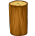
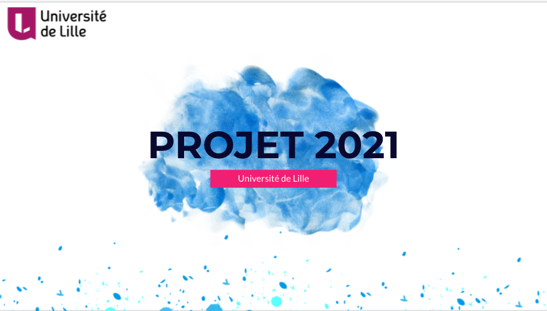

# L2S4 Projet 2021


### Equipe

-   Zakaria ELKHAYARI
-   Isidore AMEVIGBE
-   Yoni GAUDIERE
-   Inas ABBACI


##### Sujet : [Le sujet 2021](https://www.fil.univ-lille1.fr/portail/index.php?dipl=L&sem=S4&ue=Projet&label=Documents)

## Introduction 

Ce projet consiste en la modélisation  et codage de deux jeux, cette modélisation permettra d'implanter différents jeux. Les jeux ont une base commune mais les règles, les types de personnages, la composition du terrain de jeu pourra varier.
L’objectif est donc faire une modélisation qui permettera à un développeur de créer un nouveau jeu en se servant de ce qui est déjà réalisé ou en ajoutant modérément des classes pour s’adapter simplement aux spécificités de son jeu sans toucher au code des classes que nous avons codé.

En effet, il s'agit de deux versions de jeu à realiser : un jeu de guerre et un jeu de développement agricole.

Ces deux jeux sont constitué d'un plateau, de joueurs et de règles.

Principe des deux jeux :

Le plateau est de forme réctangulaire, celui-ci est divisé en tuiles, les joueurs manipulent donc des personnages qu'ils vont pouvoir positionner sur les tuiles, chaque tuile peut produire un type de ressources que récoltent les joueurs à chaque tour de jeu. Ces ressources peuvent être  converties.
Donc le fonctionnement général des jeux est :

On choisit un nombre de tours et chaque joueur joue tour à tour et peut donc :
1. Effectuer une action (deployer,ne rien faire...).
1. Récolter des ressources.
1. Nourrir/payer aux personnages deployées.


Jeu de guerre :

dans ce jeu, le joueur déploie ses armées sur des territoires et nourrit ses soldats et surveille donc ses adversaires qui pourront lui voler des armées.

Ces armées sont caractérisées par un nombre de guerriers( entre 1 et 5) et possédent de l'or gagné lors des conquêtes de territoires. Elles prennent position sur des tuiles de type

    - Montagnes
    - Plaines
    - Désert
    - Forêt.

 Ces derniéres produisent respectivement :

    - Roche
    - Blé
    - Sable
    - Bois
 
Des tuiles de type océan existent également mais ne peuvent pas recevoir d'armée.
L'objectif du jeu est d'obtenir le plus de points aprés 10 tours.

Jeu de développement agricole : 

Dans ce jeu, le joueur déploie des ouvriers agricoles qui doivent être payés afin d'exploiter des territoires. Grâce à leur production, ces ouvriers gagnent de l'or.

Les tuiles et ressources sont les memes que pour le WarGame.

L'objectif du jeu est d'obtenir le plus de points aprés 10 tours. Les points sont calculé de la façon suivante: La somme total de l'or des ouvriers deployées.


# Livrables

## Livrable 1

Modélisation de la classe des personnages

### Atteinte des objectifs

<div > La classe des Players est modélisée avec les méthodes nécessaires 
la classe WarPlayer pour le jeu de guerrier hérite de la classe des Players
de même que la classe Farmer également (avec toutes les méthodes possibles) </div>
 
### Difficultés restant à résoudre

## Livrable 2

<div > Le livrable 2 conçerne le <strong>tableau</strong> de jeu le tableau est défini selon une largeur et une longueur définie lors de sa création. Pour pouvoir avoir un tableau contenant des tuiles forêt oo plaine ou Montagne. Il faut minimum un tableau de dimensions( 3,2) ou (2,3) .
</div>

### Atteinte des objectifs

<div > La modélisation du tableau a été réalisé avec succès dont voici :
L'on a créé une interface Tuile ( <strong>Tile</strong> ) qui fera hérité la classe  UnusableTile et UsableTile qui fait hérité des classes comme 
<ul>
	<li> Desert</li>
 	<li> Plaine</li>
 	<li> Montagne</li>
L'intérêt de l'interaface Tile est qu'il permettra d'avoir accès à toutes les méthodes.

Cela rend également notre jeu à pouvoir ajouter d'autres tuiles plus tard.

La classe UnusableTile nous permet d'avoir plus tard d'autres tuiles non utilisable.

Pour le tableau on a une classe abstraite Board car l'on ne doit pas avoir accès.
Après on a créé une classe ClassicBoard qui hérite de Board et permet de créer un tableau .</div>

#### Explication de la méthode initBoard

<div>
la méthode <strong>initBoard</strong> initialise un tableau avec des tuiles océans qui ont une taille minimum représentant 2/3 de la taille totale du tableau. les autres tuiles représentent donc le reste de la taille du tableau.

cette méthode utilise <strong>generateAdjacentTile(int x,int y)</strong> qui génère toutes les tuiles adjacentes
de coordonée (x,y )
et il nous renvoie le résultat sous la forme <strong>{{x1,y1}, {x2,y2}</strong>, etc..} (un ArrayList contenant des hashmap}

le pourquoi l'on a adopter ce concept est que un HashMap ne prend pas en charge les doublons de clé
.

Cette méthode est assez longue, il présente tous les cas possibles des coordonnées ex :
si on est à la fin du tableau il ne doit pas y avoir de tuile sud ni Est .

Ensuite on a les méthodes <strong>positionXrandom</strong> et positionYrandom qui tire deux aléatoire car (les positions de chaque tuiles n'est pas connu d'avance tout est aléatoire)

la méthode <strong>randomNumberofTileNext(int size)</strong> tire un nombre aléatoire entre 1 et la taille des tuiles adjacentes d'un coordonnée . Cette méthode nous permet de déterminer le nombre de tuile adjacente à placer à côté de notre tuile principale.

la méthode <strong>randomofTile()</strong> choisit un nombre aléatoire entre 1 et 4 inclus et ce nombre nous permet de choisir le type tuile à placer si le nombre renvoyé c'est 1 on sait que c'est une tuile de type Desert.
d'où l'interêt de la méthode <strong>generateTile(int number,int x2, int y)</strong> qui en fonction du nombre number crée une tuile à la position x2, y.

la méthode <strong>randomNumber4(int x)</strong> choisit une tuile aléatoire à placer.

la méthode <strong>represente</strong> nous dessine enfin notre tableau.

</div>

### Difficultés restant à résoudre

<div>
Pour le livrable 2 l'une des difficultés est de réduire un peu le code de ClassicBoard 
ensuite  limiter la taille de tableau à créer on pourra réfléchir plus tard comment faire pour avoir des tableau selon chaque niveau de jeu.

En plus il restera à optimiser la classe Océan de telle sorte que celui-ci n'hérite pas de Tile.
Car cela nous force à faire de surcharge des méthodes signés lors de l'interface Tile.

</div>

## Livrable 3

<div > Le livrable 3 conçerne la modélisation des actions et cela a été effectué avec succès.

</div>

### Atteinte des objectifs

<section>
<div>
Nos objectifs sont atteints du côté de la modélisation des actions mais par contre il reste les codes du livrable 3 à réaliser </div></section>
<section><div>
Nous sommes partis sur le fait qu'on dispose de trois actions et ces actions peuvent être réalisé par des classes . On a l'action de <strong>Deployer</strong> Et pour cette action nous l'avons modélisé avec la classe <strong>Deploy</strong> qui est une classe abstraite car cela nous permettait de faire hériter d'autres classes comme ceux de <strong>DeployArmy</strong> et <strong>DeployWorker</strong> car déployer un ouvrier n'est pas la même chose que le fait de déployer une armée par exemple le fait de déployer une armée affecte les armées des tuiles adjacentes (Nord, Sud, Ouest, Est) . Ensuite on dispose de la classe <strong>DoNothing</strong>(Ne rien faire)  
qui permet d'effectuer la récolte des Ressources. Cette classe nous permet également de créer deux autres classes <strong>DoNothingForWarGame</strong> et <strong>DoNothingForFarmerGame</strong> qui nous permettent de faire de récolte selon le type de jeu. Ensuite en dernière position on dispose de la classe <strong>ChangeRessource</strong> qui permet de réaliser l'action
d'échange de ressource contre de l'or ou de point selon qu'on est dans le jeu de guerre ou de fermier. Ainsi suivant cette contrainte on a crée deux autres classes <strong>ChangeRessourceforWarGame</strong> et <strong>toChangeRessourceforFarGame</strong> .

### Difficultés restant à résoudre

<section> <div>
Au niveau des difficultés c'est d'essayer de voir si c'est nécessaire de réaliser une interface Tile commun aux actions car cela va nous obliger de créer certains méthodes qu'on aura pas forcément besoin selon les actions </div></section>

<section> <div>
Revoir les methodes pay et feed de Player, On a rajouté les methodes getFood dans Player, eat et getPayed dans Character qui renvoient une exception si le Player n'a pas assez d'or ou de nourriture pour satisfaire le Personnage. La methode eat renvoie le nombre de nourritures consommées ou une exception si pas assez de nourriture  
</div></section>

## Livrable 4
<div style="font-family:'Helvetica', sans-serif; background-color:#F0F8FF; ">Le livrable 4 concerne la modélisation de tout le jeu, dans cet livrable nous avions effectué 
 la modélisation d'une classe Game
</div>

### Atteinte des objectifs
<div style="font-family:'Helvetica', sans-serif; background-color:#F0F8FF; ">Nous avions effectué la modélisation d'une classe Game avec pour attribut le tableau, le 
nombre de tours de jeu qui est de base limité à 10, on a également une liste des joueurs avec leurs points, 
et une liste des actions.

Cette classe étant une classe abstraite fait hériter deux autres classe FarmGame (pour le jeu agricole) et WarGame (celui du jeu de Guerre).

Ces classes permettent de jouer au jeu et faire ainsi donc toutes les impressions possibles.

Elles nous font rassembler l'ensemble des classes effectués tel que Board, Actions, et celui des Personnages.
 
</div>

### Difficultés restant à résoudre
<div style="font-family:'Helvetica', sans-serif; background-color:#F0F8FF; ">
Pour ce niveau on a pas eu de difficultés car on avait pas trop de choix si on veut permettre une création facile 
d'autres jeux plus tard. 
Si il y a une autre classe de jeu plus tard celui-ci hériterait directement de Game et aura	donc toutes ses méthodes ce qui
rendrait plus facile la création.
</div>

# Journal de bord

## Semaine 1

<div style="font-family:'Helvetica', sans-serif; background-color:#F0F8FF; "> La première semaine nous avons commencer a décortiquer et analyser le sujet.<br> Nous avons essayer de nous mettre d'accord sur notre vision des jeux afin que cela soit plus simple pour nous de faire un premier diagramme UML de nos idées,<br> en commencent par les Personnage.</div>

## Semaine 2

<div style="font-family:'Helvetica', sans-serif; background-color:#F0F8FF; ">Nous avons une modélisation stable des Personnages.<br> Nous avons commencer a code et rajouté toutes les méthodes nécessaires qu'on adaptera selon la modelisation de Players.</div>

## Semaine 3

<div style="font-family:'Helvetica', sans-serif; background-color:#F0F8FF; "> Cette semaine a permis de finir de mettre à jour la plupart des méthodes des classes liées aux personnages, ainsi que d'avancer sur l'UML notamment Board, nous avons commencé le code du Board en parallèle pour tester la logique de notre modélisation. </div>

## Semaine 4

<div  style="font-family:'Helvetica', sans-serif; background-color:#F0F8FF; "> ( irruption pédagogique ) Cette semaine une partie de l'équipe s'occupera du code de test pour la classe Board et une autre partie la modélisation complète des actions.
</div>

## Semaine 5

<div style="font-family:'Helvetica', sans-serif; background-color:#F0F8FF; "> Nous avons continuer d'avancer sur le code et de regler certain problemes de la modelisation des actions et quelque rajout pour la classe board</div>

## Semaine 6

<div style="font-family:'Helvetica', sans-serif; background-color:#F0F8FF; ">Pour cette semaine nous avons pris un peu de retard au niveau des codes, nous avons encore réalisé aucun test unitaire y compris le code du premier livrable qui n'est pas encore effectué. Cela est dû en parti a nos examens cette semaine.   </div>

## Semaine 7

<div style="font-family:'Helvetica', sans-serif; background-color:#F0F8FF; ">Semaine qui nous a permis de rectifier certains oublis. Ajout de méthodes comme getPaye(), getGold(), paye() qui nous permet de donner la paye à l'ouvrier en fonction de sa tuile, ...
Nous avons fait quelques modifications dans tile afin d'améliorer notre code. </div>

## Semaine 8 

<div  style="font-family:'Helvetica', sans-serif; background-color:#F0F8FF; "> cette semaine nous avons fini la classe player, afin de pouvoir créer des joueurs pour jouer aux jeux Agricole et Conquête de territoires. </div>

## Semaine 9
<div style="font-family:'Helvetica', sans-serif; background-color:#F0F8FF; "> Nous avons commencé l'interface graphique, les jeux sont quasiment finis, on a également commencé à simplifier le code, c'est-à-dire, supprimer les methodes qu'on a pas utilisé et mettre les méthode communs dans les classes mères. </div>

## Semaine 10

<div style="font-family:'Helvetica', sans-serif; background-color:#F0F8FF; "> Nous avons commencé les tests unitaires car on s'est rendu compte qu'on avait des erreurs dans le code, les tests unitaire nous ont permis de détecter ces erreurs.</div>

## Semaine 11

<div style="font-family:'Helvetica', sans-serif; background-color:#F0F8FF; "> Nous avons terminer les tests. Nous avons commencer a organiser nos fichiers afin de pouvoir faire le Makefile plus facilement. Nous avons aussi commencer a réflechir a un diapo pour présentation.  </div>

## Semaine 12

<div style="font-family:'Helvetica', sans-serif; background-color:#F0F8FF; "> Le diaporama est toujours en cours de réalisation afin de présenter au mieux le développement de projet.
Nous nous somme organiser afin de répartir les tâches pour la présentation. </div>

### Tree du projet

```console
├── Makefile
├── README.md
├── assets
│   ├── images
│   └── sounds
├── classes
├── modelisation
├── src
│   ├── BoardMain
│   │   └── BoardMain.java
│   ├── WarGameMain
│   │   └── WarGameMain.java
│   ├── farmGameMain
│   │   └── FarmGameMain.java
│   ├── game
│   │   ├── Action.java
│   │   ├── Board.java
│   │   ├── Character.java
│   │   ├── Game.java
│   │   ├── Player.java
│   │   ├── Resource.java
│   │   ├── Tile.java
│   │   ├── action
│   │   │   ├── Deploy.java
│   │   │   ├── DeployFarmGame.java
│   │   │   ├── DeployWarGame.java
│   │   │   ├── DoNothing.java
│   │   │   ├── DoNothingFarmGame.java
│   │   │   ├── ExchangeRessource.java
│   │   │   ├── ExchangeRessourceFarmGame.java
│   │   │   └── ExchangeRessourceWarGame.java
│   │   ├── board
│   │   │   └── ClassicBoard.java
│   │   ├── farmGame
│   │   │   ├── FarmGame.java
│   │   │   ├── FarmPlayer.java
│   │   │   └── Farmer.java
│   │   ├── resource
│   │   │   ├── Corn.java
│   │   │   ├── Rock.java
│   │   │   ├── Sand.java
│   │   │   └── Wood.java
│   │   ├── tile
│   │   │   ├── Desert.java
│   │   │   ├── Forest.java
│   │   │   ├── Mountain.java
│   │   │   ├── Ocean.java
│   │   │   ├── Plain.java
│   │   │   ├── UnusableTile.java
│   │   │   └── UsableTile.java
│   │   ├── util
│   │   │   ├── exception
│   │   │   │   ├── ArmyNotFeededException.java
│   │   │   │   ├── NoPlayersInGameException.java
│   │   │   │   ├── NoUsableTileAvailableException.java
│   │   │   │   ├── NotEnoughFoodException.java
│   │   │   │   ├── NotEnoughGoldException.java
│   │   │   │   ├── RessourceNotAvailableException.java
│   │   │   │   ├── TileNotInBoardException.java
│   │   │   │   ├── TilenotAvailableException.java
│   │   │   │   ├── TooManyCharacterforDesert.java
│   │   │   │   ├── TooManyCharacterforMountain.java
│   │   │   │   └── WrongSizeCharacterException.java
│   │   │   └── io
│   │   │       └── Colors.java
│   │   └── warGame
│   │       ├── Army.java
│   │       ├── WarGame.java
│   │       └── WarPlayer.java
│   └── gameGUI
│       ├── #ici tous les .java
│       └── util
├── jar
│   └── #ici les .jar et les manifest
├── test
│   └── game
│       ├── action
│       ├── board
│       ├── farmGame
│       ├── resource
│       ├── tile
│       └── warGame
└── test4poo.jar
```

## Notre Makefile


Pour créer tous les fichier .class : `make cls`, pour les effacer `make clean`.

-   Pour lancer le jeu Agricole:

    ```
    $ make playFarmGame
    ```

-   Pour lancer le jeu de Guerre :

    ```
    $ make playWarGame
    ```

**_Les tests :_**

-   Pour compiler les tests : 
    
    ```console
    $ make tests
    ```
-   Pour executer un test:

    ```console
    $ make #NomDuTest
    ```
    
    Par exemple, pour executer le test CornTest on tape la commande :

    ```console
    $ make game.resource.CornTest
    ```

**_Documentaion :_**

-   Pour generer la docuemntation :

    ```console
    $ make doc
    ``` 

    Puis ouvrir `doc/index.html`:

    -   Linux :

    ```console
        $ xdg-open doc/index.html
    ```

    -   MacOs :

    ```console
        $ open doc/index.html
    ```

    -   Windows (cmd) :

    ```console
        $ doc/index.html
    ```

**_Creation des .jar :_**

-   Pour créer l'executable `agricole.jar :`

    ```console
    $ make agricole.jar
    ```
    
-   Pour créer l'executable `guerre.jar :`

    ```console
    $ make guerre.jar
    ```
    - Puis les executer:

        - Jeu Agricole:    
            ```console
            $ java -jar jar/agricole.jar NomDuJoueur  NomDuJoueur2     ...
            ```
        - Jeu Guerre :
            ```console
            $ java -jar jar/guerre.jar NomDuJoueur  NomDuJoueur2    ...
            ```

-   Pour créer l'executable `agricoleI.jar :`

    ```console
    $ make agricoleI.jar
    ```

-   Pour créer l'executable `guerreI.jar :`

    ```console
    $ make guerreI.jar
    ```

**_Interface graphique :_**

-   Pour lancer le jeu Agricole en GUI:

    ```console
    $ make FarmGameGUI
    ```

-   Pour lancer le jeu de Guerre en GUI:
    
    ```console
    $ make WarGameGUI #toujours pas fini.
    ```

### Fonctionnalités implémentées

#### Interaction 

Nous avons rajouté un mode interactif pour controler les joueur. Un attribut `ìnteractive` de type boolean a été rajouté dans les Players pour determiner si un player
est interactif.

Vous pouvez tester avec la commande : `make playFarmGameI` ou `make playWarGameI`.
Ces deux commandes lance une partie : un avec 2 joueurs en interactif et un en aléatoire.

Vous pouvez également creer le `guerreI.jar` ou `agricoleI.jar` avec les commandes : `make guerreI.jar` et `make agricoleI.jar`.

Puis les executer:
- Jeu Agricole:    
    ```console
    $ java -jar jar/agricoleI.jar NomDuJoueur true/false NomDuJoueur2 true/false    ...
    ```
- Jeu Guerre :
    ```console
    $ java -jar jar/guerreI.jar NomDuJoueur true/false NomDuJoueur2 true/false    ...
    ```
(true si le joueur est interactif, false sinon). 

#### GUI

Nous avons créer une interface graphique pour chaque jeu avec Swing.


##### Jeu agricole

Description des éléments du jeu:

-  : Les points
-  : L'or
-  : Blé
-  : Roche
-  : Bois
-  : Sable
 

**Gameplay du jeu Agricole: [demo](https://youtu.be/z_OUOGQqDxM)**

##### Jeu de guerre

**Gameplay du jeu de Guerre: `toujours pas fini`**

Sous un système d'exploitation Unix (MacOS, Ubuntu, Debian, etc) vous aurez pas de soucis pour lancer le jeux.

Avec Windows vous devez baisser la taille de mise à l’échelle à 100% pour afficher le jeu correctement, pour cela on vous laisse un tutoriel : [lien](https://lecrabeinfo.net/windows-10-modifier-mise-a-lechelle-ppp-dpi-ecran.html)


- Tree des packages GUI :
    ```console
    src/gameGUI
    ├── ActionsPanel.java
    ├── BoardPanel.java
    ├── FarmGameGUI.java
    ├── GameFrame.java
    ├── ImagePanel.java
    ├── MenuPanel.java
    ├── MyJOptionPane.java
    ├── OptionsPanel.java
    ├── PlayersPanel.java
    ├── RulesPanel.java
    ├── WarGameGUI.java
    └── util
        └── SimpleAudioPlayer.java
    ```


-  Pour lancer le jeu Agricole en GUI:

    ```console
    $ make FarmGameGUI
    ```

-  Pour lancer le jeu de Guerre en GUI (toujours pas fini):
    
    ```console
    $ make WarGameGUI #toujours pas fini.
    ```


### Presentaion

<p align="center">
  
  <br><br>
  <a href="https://docs.google.com/presentation/d/1urYdbgQst0Za49Ul0jiBfbE6VjSYvmJs8JrU25vsulM/edit?usp=sharing">Lien presentation</a>
  <br><br>
</p>

### Sources

Pour l'interface graphique nous avons rencontré beaucoup de difficultés, voici les sites web qui nous ont aidé :

-   Pour les effets sonores : [kenney.nl](https://kenney.nl/assets)
-   Pour la musique de fond : [soundimage.org](https://soundimage.org/fantasywonder/)
-   Pour les images et buttons :

    -   [iconarchive.com](https://iconarchive.com/show/keyboard-keys-icons-by-chromatix.html)
    -   [freepik.com](https://www.freepik.com/)
    -   [textcraft.net](https://textcraft.net/)

-   Les sites qui nous ont permis de retoucher nos images :

    -   [reduceimages.com](https://www.reduceimages.com/)
    -   [manytools.org](https://manytools.org/image/colorize-filter/)

-   Pour toutes les difficultés que nous avons rencontré : [stackoverflow.com](https://stackoverflow.com)

<!-- eof -->
